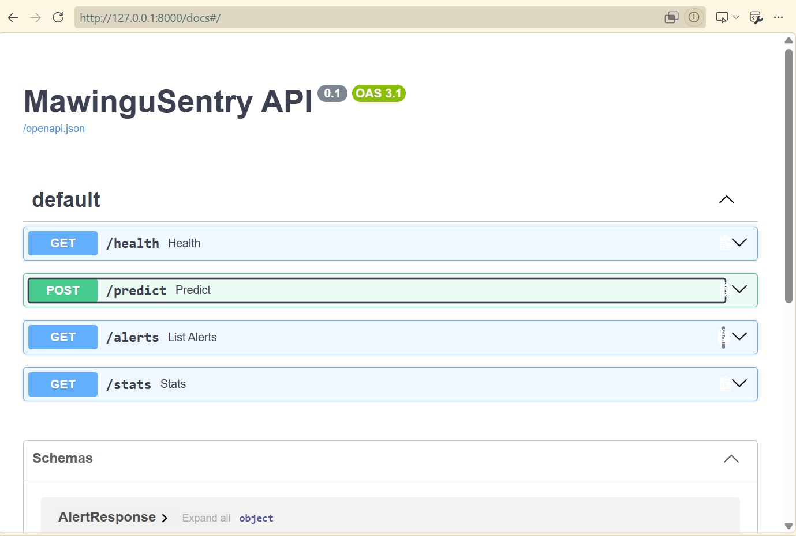

# MawinguSentry

AI-driven cloud security threat detection — retargeting the hybrid ML
architecture from [FraudDetectPro](https://github.com/TamaraChelagat/FraudDetectPro)
(a final-year fraud detection system) at a different problem: flagging
malicious activity in AWS CloudTrail-style event logs.

**Status:** Weeks 1–3 of 4 complete. See [ROADMAP.md](ROADMAP.md) for the
build plan.

## Why this project

Fraud detection and cloud threat detection are the same underlying problem:
extremely rare positive events buried in a high volume of normal activity,
where both false positives (analyst fatigue) and false negatives (missed
attacks) are costly, and where a black-box "it's fraud" or "it's an attack"
verdict isn't good enough — an analyst needs to know *why*. MawinguSentry
reuses FraudDetectPro's actual working architecture — an ensemble (XGBoost,
LightGBM, Random Forest, Logistic Regression, Isolation Forest) stacked by
a logistic regression meta-learner, plus its SHAP explainability layer —
retrained on a new domain: AWS CloudTrail events instead of credit card
transactions. (Early planning for both projects described a neural-network
feature extractor ahead of the ensemble; it was tried and dropped in
FraudDetectPro itself, so this project builds on the architecture that's
actually proven to work — see
[docs/MODEL_RESULTS.md](docs/MODEL_RESULTS.md) for the full note.)

## Architecture

```
Log ingestion (CloudTrail + synthetic generator)
        |
Feature engineering (parse events, extract signals)
        |
Ensemble + meta-learner (XGBoost, LightGBM, Random Forest,
Logistic Regression, Isolation Forest -> stacked meta-learner)
        |
FastAPI + SHAP service (score, explain, tag MITRE ATT&CK)
        |
Alert dashboard (React UI + SQLAlchemy storage)
```

## What's built so far

- [x] `app/data_generator.py` — synthetic CloudTrail-style event generator
      producing benign baseline traffic plus five labeled attack scenarios
      mapped to MITRE ATT&CK for Cloud. See
      [docs/THREAT_SCENARIOS.md](docs/THREAT_SCENARIOS.md).
- [x] Test suite + CI (GitHub Actions runs lint + tests on every push)
- [x] Feature engineering pipeline
- [x] Hybrid detection model (retrained on security event features)
- [x] FastAPI service with `/predict`, `/alerts`, `/stats`, `/explain`
- [x] SQLAlchemy-backed alert storage (SQLite dev / Postgres production)
- [ ] React alert dashboard
- [ ] Deployment (Fargate/Lambda + Vercel)

## API service

Interactive Swagger docs, generated automatically by FastAPI at `/docs`:



## Model training results

Held-out test set performance after training on 5,000 synthetic events.
Full breakdown, including per-scenario recall and the honest recon-burst
limitation, in [docs/MODEL_RESULTS.md](docs/MODEL_RESULTS.md).


## Quickstart

```bash
python -m venv venv
source venv/bin/activate  # Windows: venv\Scripts\Activate.ps1
pip install -r requirements.txt

# Generate a batch of synthetic events
python app/data_generator.py --batch-size 200 --attack-ratio 0.08 --seed 42

# Train a model
python scripts/train_model.py --generate 5000 --seed 2026

# Run the API
uvicorn app.main:app --reload
# then visit http://localhost:8000/docs

# Run tests
pytest tests/ -v
```


## Related projects

- [FraudDetectPro](https://github.com/TamaraChelagat/FraudDetectPro) — the
  fraud detection system this project's model architecture is adapted from.

## Tech stack

FastAPI · scikit-learn · XGBoost · LightGBM · imbalanced-learn · SHAP ·
SQLAlchemy (SQLite / Postgres) · React · MITRE ATT&CK
